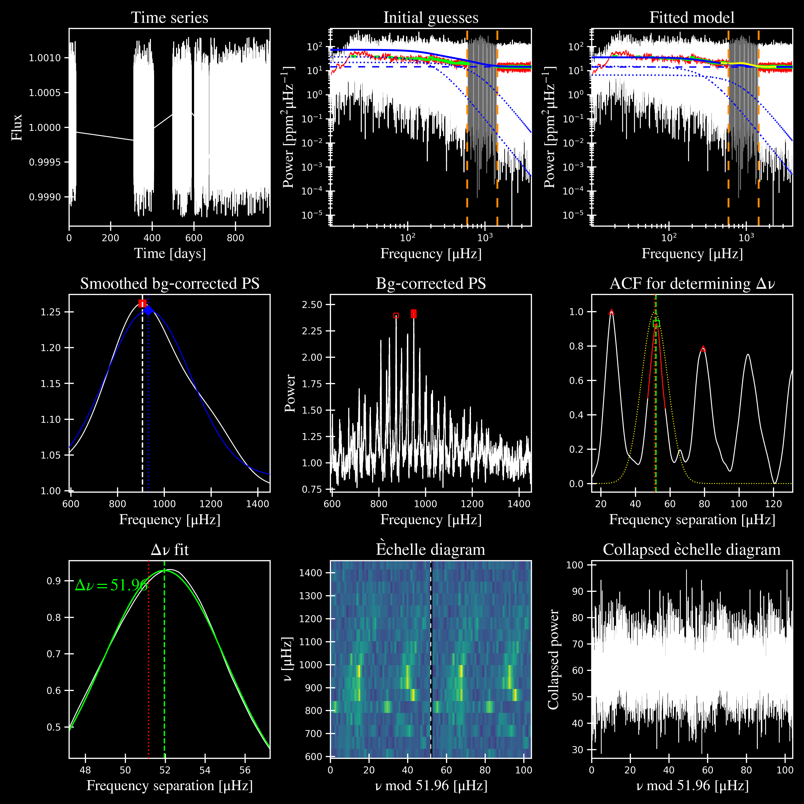

.. _advanced:

Advanced Usage
#################

Below are examples of how to use specific ``pySYD`` features, as well as plots showing results before and after their usage.

``--kc``
++++++++

**Before:**

.. code-block:: bash

    $ pysyd run -star 3852594

.. code-block:: bash

    $ pysyd run -star 3852594

  

**After:**

.. code-block:: bash

    $ pysyd run -star 3852594 --kc

